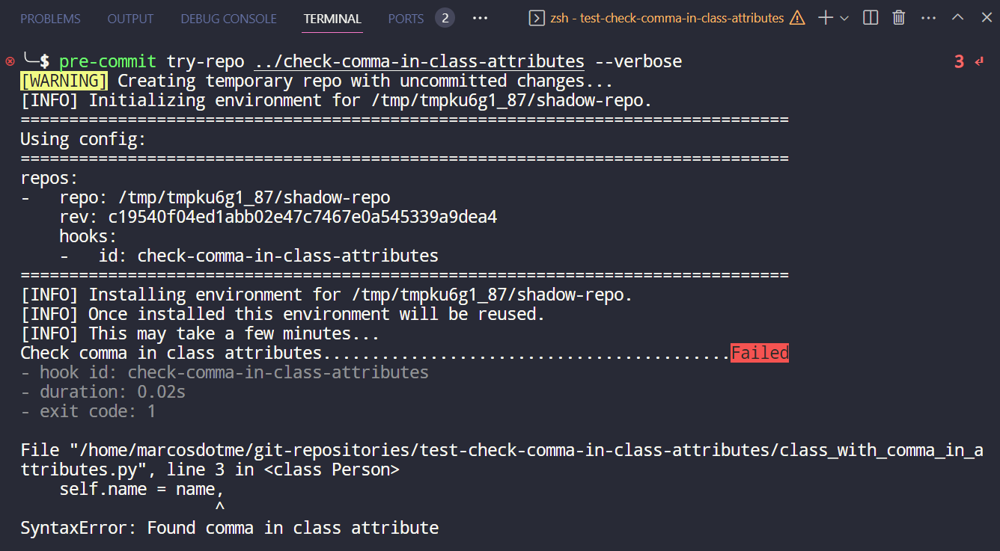

# check-comma-in-class-attributes

Pre-commit hook to check if has a comma in any class attribute.

But why it matters?

```python
# main.py

class Person:
    def __init__(self, name: str, age: int) -> None:
        self.name = name,
        self.age = age

    def greet(self) -> None:
        print(f"Hi, my name is {self.name} and I'm {self.age} years old!")

person_1 = Person(name='Marcos', age=25)
person_1.greet()
```

If you execute the `main.py` you got:

```
Hi, my name is ('Marcos',) and I'm 25 years old!
```

Instead of:

```
Hi, my name is Marcos and I'm 25 years old!
```

<br>

## Usage

It's  only possible to use this hook with `pre-commit`, so put this inside your `.pre-commit-config.yaml`:

```yaml
- repo: https://github.com/marcosdotme/check-comma-in-class-attributes
  rev: 0.1.0
  hooks:
    - id: check-comma-in-class-attributes
```

<br>

## Demo output


